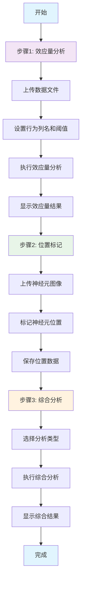

# 神经元分析工作流程

## 新的两步式工作流程

根据效应量分析和位置标记的功能，实现了以下工作流程：

### 工作流程步骤

### 主要功能特性

#### 1. 效应量分析步骤
- **数据上传**: 支持Excel和CSV格式的神经元活动数据
- **参数设置**: 可配置行为列名和效应量阈值
- **结果展示**: 
  - 效应量分布直方图
  - 效应量热力图
  - 关键神经元列表
  - 统计摘要信息

#### 2. 位置标记步骤
- **图像上传**: 支持JPG、PNG等图片格式
- **交互式标记**: 点击图像标记神经元位置
- **位置管理**: 支持添加、删除、编辑标记点
- **数据导出**: 可导出位置数据为JSON格式

#### 3. 综合分析步骤
- **分析类型选择**:
  - 效应量-位置关联分析
  - 空间聚类分析
  - 行为-位置热力图
  - 综合可视化
- **可视化参数**: 可选择显示效应量、位置、行为标签、聚类等
- **结果展示**: 多种可视化图表和详细数据表格

### 技术实现

#### 前端架构
- **Vue 3 Composition API**: 使用响应式数据管理
- **Element Plus**: UI组件库，提供丰富的交互组件
- **工作流程状态管理**: 步骤间的数据传递和状态控制
- **响应式设计**: 适配不同屏幕尺寸

#### 数据流
1. **效应量数据**: 从后端API获取，包含效应量矩阵和统计信息
2. **位置数据**: 通过PositionMarker组件收集，包含坐标信息
3. **综合分析**: 结合两种数据进行深度分析

#### API集成
- **效应量分析API**: `/api/neuron/effect-size`
- **位置分析API**: `/api/neuron/position`
- **综合分析API**: `/api/neuron/comprehensive-analysis`

### 用户体验优化

#### 工作流程指引
- **步骤指示器**: 清晰显示当前进度和完成状态
- **自动跳转**: 完成当前步骤后自动进入下一步
- **数据验证**: 确保每步都有必要的数据才能继续

#### 交互设计
- **拖拽上传**: 支持文件拖拽上传
- **实时反馈**: 操作过程中提供进度提示
- **错误处理**: 友好的错误信息和恢复建议

#### 结果展示
- **多标签页**: 不同类型的结果分标签展示
- **数据表格**: 详细的数据查看和导出
- **可视化图表**: 直观的图表展示分析结果

### 扩展性

这个新的工作流程设计具有良好的扩展性：

1. **新分析类型**: 可以轻松添加新的分析类型
2. **新可视化**: 可以集成更多的可视化组件
3. **新数据源**: 可以支持更多类型的数据输入
4. **新步骤**: 可以在工作流程中添加新的分析步骤

### 总结

重写后的NeuronAnalysis页面实现了：
- ✅ 清晰的三步式工作流程
- ✅ 效应量分析和位置标记的完美结合
- ✅ 丰富的可视化展示
- ✅ 良好的用户体验
- ✅ 可扩展的架构设计

这个新的设计使得神经元分析更加系统化和用户友好，为研究人员提供了强大的分析工具。
